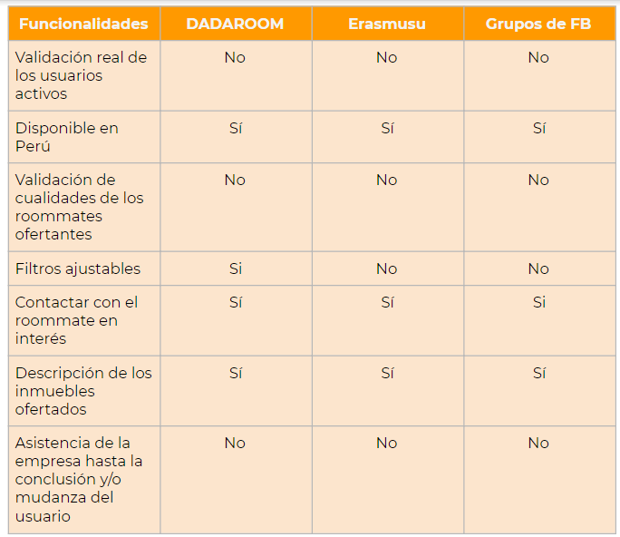
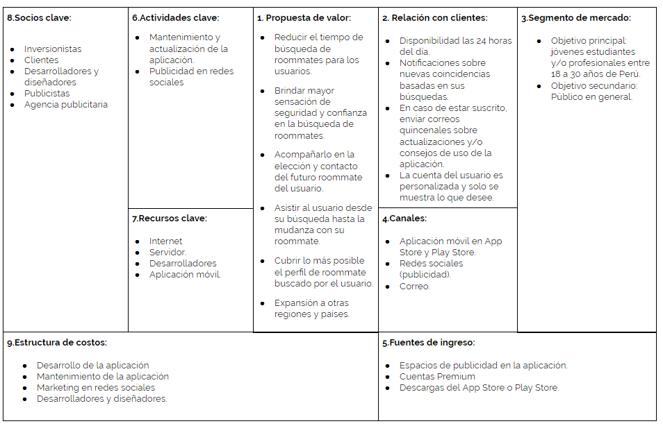

# Proyecto: Room & Soul

Room & Soul Mate es una forma sencilla de buscar roommates (compañeros de cuarto) en el Perú. Problemas en tu búsqueda? Con filtros ajustados a tu necesidad, Room & Soul te brinda la seguridad y confianza que necesitas.

La investigación correspondiente permitió conocer más acerca de las necesidades y preferencias del usuario y se propuso una forma más funcional y práctica en cuanto a la experiencia de usuario.

### PROCESO UX

## DESCUBRIMIENTO E INVESTIGACIÓN

### Objetivo

Brindar una forma sencilla, rápida y efectiva de la búsqueda de roommates en Perú así mismo que se ofrece mayor seguridad y confianza a los usuarios que utilizan Room & Soul.

### Situación actual

Actualmente, la independización de los jóvenes y adultos va en aumento y por diferentes razones. Pero no son jóvenes cualquiera, aquellos que deciden optar por independizarse no pueden hacerlo solos en su totalidad por lo que recurren a compartir obligaciones con los llamados roommates.

Encontrar el roommate ideal puede significar una experiencia divertida o tormentosa ya que implica una compatibilidad de costumbres y/o estilo de vida, la confiabilidad del compañero, administración y ahorro sobre los gastos de mantener una vivienda. 

Es por ello que es importante comprender y brindar mejores experiencias a estos clientes.

### Plan de investigación

* Encuestas

Se realizó encuestas online y presenciales a jóvenes estudiantes y/o trabajadores.

**Conclusiones de las encuestas**

* De la muestra, un 36% de usuarios ha alquilado una habitación de manera independiente y un 64% nunca ha compartido habitación.
* De aquellos que han compartido, un 55% lo hizo con amigos y solo un 9% lo encontró por Internet.
* El motivo principal de búsqueda de habitación es por estudios, seguido por trabajo e independización del hogar familiar.
* En promedio, toma de 3 a 4 semanas alquilar una habitación.
* Una de las principales características preferidas por los usuarios es la seguridad seguido por la comodidad y zona de la habitación.

* Entrevistas

¿Consideras que las páginas como Dadaroom o Erasmusu son efectivas en la búsqueda de roommates?

_En general, los usuarios no conocían las páginas y lo consideraban poco confiables._

Sobre los perfiles que se muestran en estas páginas, ¿Qué opción consideras te da o daría mayor confianza?

_En general, los usuarios consideraban que una validación o una verificación como páginas de Twitter o Instagram le daría más confianza._

_También que puedan validar o visualizar algún puntaje sobre cualidades como organización, limpieza o puntualidad de pago._

¿Qué agregarías o mejorarías a las páginas y/o aplicaciones?

_En general, se propuso que un chat a través de la aplicación porque sentirián un respaldo y prevendría casos de acoso y/o estafa._

_Además de que no les gustaría intercambiar información personal como celulares o cuentas de redes sociales en el primer contacto._

Si la página o aplicación tuviera una opción de asistencia para tu mudanza, ¿la usarías?

_En general, los usuarios mostraron poco interés y utilidad en la opción pero que por curiosidad la probarían._

* Artículos de Referencia

[Dadaroom](http://www.dadaroom.com/blog/)

[Roommate - Como hacer que la experiencia no sea un tormento](https://expansion.mx/salud/2012/09/25/roommate-como-hacer-que-la-experiencia-no-sea-un-tormento)

[La aventura de compartir](https://lifestyle.americaeconomia.com/articulos/la-aventura-de-compartir-el-espacio-consejos-para-vivir-con-otras-personas)

## SINTESIS Y DEFINICIÓN

### Mapa de Afinidad

**Temas encontrados**

* Alquiler solo

_64% de los usuarios dijo que habían alquilado solos._

* Alquiler con roommates

_36% de los usuarios dijo que habían alquilado con roommates._

* Motivos del alquiler

_"El instituto/universidad estaba lejos de mi casa."_

_"El trabajo estaba lejos de mi casa."_

_"Quería disfrutar mi soltería."_

* Tiempo de búsqueda

_36% indicó que le tomaba de 3 a 4 semanas._

_27% indicó que le tomaba de 1 a 2 semanas._

_18% indicó que le tomaba más de 4 semanas._

_Y la diferencia entre 1 a 4 días._

* Medios de búsqueda

_"Fue para viajar. El proceso por Booking.com."_

_"Buscar en grupos de Facebook y por conocidos."_

_"Buscar en la web."_

_"Búsqueda en diarios y letreros en las calles."_

_"Airbnb"_

* Estudian y trabajan

_55% de los usuarios indicaron que realizan ambas actividades._

* Seguridad

_91% de los usuarios indicaron como prioridad esta característica al buscar habitaciones._

* Comodidad

_73% de los usuarios también indicaron esta característica como prioridad._

### Presentación del problema

Luego de analizar las respuestas de las encuestas online y entrevistas a los usuarios, se rescata que los mismos consideran las plataformas web de algunas páginas como poco confiables. Además de que consideran como prioridad su seguridad al buscar un roommate o habitación y que el tiempo de búsqueda sea más corto.

Por lo que, apoyada en el mapa de afinidad se concluyó:

_"La falta de confiabilidad de las páginas que ofrecen servicio de búsqueda de roommates."_

### Benchmarck

### Business Model Canvas

### User Persona Primario

## PROTOTIPADO

[Prototipo en alta fidelidad](https://projects.invisionapp.com/share/HJGGVTMK8NQ#/screens/286802002)
